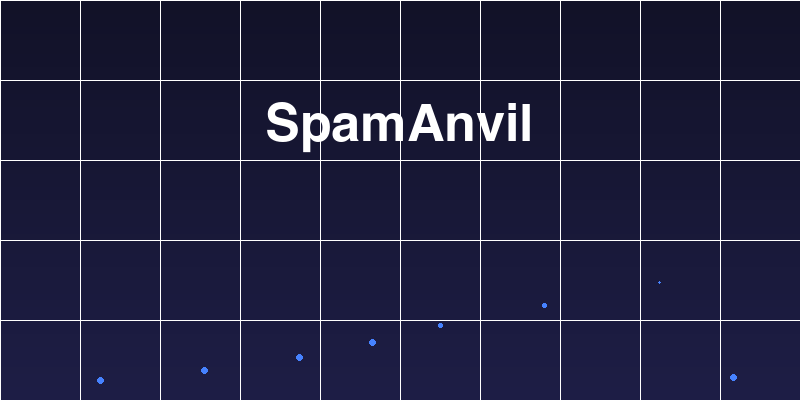

<p align="center">
  
</p>

<h1 align="center">SpamAnvil</h1>

<p align="center">
  <strong>AI-powered anti-spam plugin for WordPress</strong><br>
  Uses ChatGPT, Claude, Gemini and other LLMs to detect comment spam.<br>
  100% free. No subscription. No premium tier.
</p>

<p align="center">
  <a href="https://www.gnu.org/licenses/gpl-2.0.html"></a>
  <a href="https://wordpress.org/plugins/spamanvil/"></a>
  <a href="#"></a>
  <a href="#"></a>
</p>

---

## Why SpamAnvil?

Traditional spam filters rely on static word lists and link counting. Spammers have evolved. **SpamAnvil fights back with AI that understands context, intent, and language patterns** -- catching spam that looks legitimate and approving real comments that others would flag.

| | Akismet | Antispam Bee | SpamAnvil |
|---|---|---|---|
| **Technique** | Cloud pattern matching | Honeypot + regex rules | LLM understanding |
| **Free for commercial sites** | No | Yes | Yes |
| **Data control** | Automattic servers | Local | Your chosen AI provider |
| **Multilingual** | Limited | No | Any language |
| **Self-hosted option** | No | N/A | Yes (Ollama, LM Studio, vLLM) |

## Supported AI Providers

| Provider | Free Option | Default Model |
|----------|:-----------:|---------------|
| **OpenAI** | No | `gpt-4o-mini` |
| **OpenRouter** | Yes | `meta-llama/llama-3.3-70b-instruct:free` |
| **Anthropic Claude** | No | `claude-sonnet-4-5-20250929` |
| **Google Gemini** | Free tier | `gemini-2.0-flash` |
| **Featherless.ai** | Free tier | `meta-llama/Meta-Llama-3.1-8B-Instruct` |
| **Any OpenAI-compatible** | Varies | Custom URL + model |

## How It Works

```
Comment submitted
  │
  ├─ 1. IP blocked? ──── Yes ──→ 403 Forbidden
  │
  ├─ 2. Heuristic pre-analysis (URLs, spam words, prompt injection patterns)
  │     └─ Score >= 95? ──── Yes ──→ Auto-spam (no API call needed)
  │
  ├─ 3. Queue for AI analysis (async) or process immediately (sync)
  │
  ├─ 4. LLM analyzes comment in context (post title, author, heuristics)
  │     └─ Returns: {"score": 0-100, "reason": "..."}
  │
  ├─ 5. Score >= threshold (default 70)? ──→ Mark as spam
  │     └─ Otherwise ──→ Auto-approve
  │
  └─ 6. Repeat offender IPs auto-blocked (24h → 48h → 96h → escalating)
```

## Key Features

- **AI-Powered Detection** -- LLM scores each comment 0-100 for spam probability
- **Intelligent Heuristics** -- Pre-analysis catches obvious spam without API calls
- **Adaptive Threshold** -- Analyzes historical data and suggests the optimal threshold
- **Async Processing** -- Background queue via WP-Cron, zero latency for visitors
- **Smart IP Blocking** -- Escalating bans for repeat offenders (24h, 48h, 96h...)
- **Auto-Retry** -- Failed API calls retry 3x with exponential backoff (1m, 5m, 15m)
- **Encrypted Keys** -- AES-256-CBC encryption, or wp-config.php constants
- **Fallback Provider** -- Backup AI so spam checking never stops
- **Prompt Injection Defense** -- 6-layer protection against adversarial comments
- **Statistics Dashboard** -- Daily activity, spam caught, API usage tracking
- **Evaluation Logs** -- Full audit trail with AI reasoning for every comment
- **Customizable Prompts** -- Full control over AI instructions
- **Moderator Bypass** -- Trusted users skip spam checking entirely
- **WooCommerce Compatible** -- Works with product reviews
- **Multilingual** -- AI understands comments in any language

## Installation

### From WordPress Admin

1. Go to **Plugins > Add New**
2. Search for **SpamAnvil**
3. Click **Install Now** then **Activate**
4. Go to **Settings > SpamAnvil**
5. Choose a provider, enter your API key, done!

### Manual Install

1. Download `spamanvil.zip` from [Releases](https://github.com/alexandreamato/spamanvil/releases)
2. Go to **Plugins > Add New > Upload Plugin**
3. Upload the zip and activate

### Free Setup (Zero Cost)

1. Create a free account at [OpenRouter.ai](https://openrouter.ai/)
2. Generate an API key
3. In SpamAnvil, select **OpenRouter** as primary provider
4. Paste your key -- the default model (`llama-3.3-70b-instruct:free`) is free!

## Security

SpamAnvil follows WordPress security best practices throughout:

- **API Keys**: AES-256-CBC encrypted in DB, or define in `wp-config.php` (never touches DB)
- **All forms**: Nonce verification + capability checks (`manage_options`)
- **All queries**: `$wpdb->prepare()` prepared statements
- **All output**: Escaped with `esc_html()`, `esc_attr()`, `esc_url()`
- **All input**: Sanitized with `sanitize_text_field()`, `absint()`, `wp_kses_post()`
- **HTTP**: `wp_safe_remote_post()` with 30s timeout
- **IPs**: SHA-256 hashed storage, masked display

### Prompt Injection Defense (6 layers)

| Layer | Defense |
|-------|---------|
| 1 | `<comment_data>` boundary tags isolate user input |
| 2 | System prompt explicitly forbids following comment instructions |
| 3 | Heuristic regex detects 14 injection patterns |
| 4 | Strict JSON validation (only `score` + `reason` accepted) |
| 5 | Temperature = 0 for deterministic output |
| 6 | Content truncated at 5,000 characters |

## Optional: wp-config.php API Keys

For maximum security, define keys as constants:

```php
define('SPAMANVIL_OPENAI_API_KEY', 'sk-...');
define('SPAMANVIL_OPENROUTER_API_KEY', 'sk-or-...');
define('SPAMANVIL_ANTHROPIC_API_KEY', 'sk-ant-...');
define('SPAMANVIL_GEMINI_API_KEY', '...');
define('SPAMANVIL_FEATHERLESS_API_KEY', '...');
```

When defined in `wp-config.php`, keys are never stored in the database.

## Architecture

```
spamanvil/
├── spamanvil.php                     # Bootstrap, constants, autoloader
├── uninstall.php                     # Clean removal (tables, options, crons)
├── includes/
│   ├── class-spamanvil.php           # Singleton orchestrator
│   ├── class-spamanvil-activator.php # DB schema (4 tables), defaults
│   ├── class-spamanvil-queue.php     # Async processing engine
│   ├── class-spamanvil-heuristics.php # Regex pre-analysis
│   ├── class-spamanvil-ip-manager.php # Smart IP blocking
│   ├── class-spamanvil-stats.php     # Metrics + threshold suggestion
│   ├── class-spamanvil-encryptor.php # AES-256-CBC encryption
│   ├── class-spamanvil-provider-factory.php
│   └── providers/
│       ├── class-spamanvil-provider.php          # Abstract base
│       ├── class-spamanvil-openai-compatible.php  # OpenAI/OpenRouter/Featherless/Generic
│       ├── class-spamanvil-anthropic.php          # Claude
│       └── class-spamanvil-gemini.php             # Gemini
├── admin/
│   ├── class-spamanvil-admin.php     # 6-tab settings, AJAX handlers
│   ├── css/admin.css
│   ├── js/admin.js
│   └── views/                        # 6 settings views
└── languages/
    └── spamanvil.pot                 # Translation template
```

## Extensibility

### Filters

```php
// Customize the prompt before sending to LLM
add_filter('spamanvil_prompt', function($prompt, $type, $comment) {
    // $type is 'system' or 'user'
    return $prompt;
}, 10, 3);

// Adjust threshold per comment
add_filter('spamanvil_threshold', function($threshold, $comment) {
    return $threshold;
}, 10, 2);

// Modify heuristic score
add_filter('spamanvil_heuristic_score', function($score, $signals, $data) {
    return $score;
}, 10, 3);
```

### Actions

```php
// Before LLM API call
add_action('spamanvil_before_analysis', function($comment, $item) {}, 10, 2);

// After analysis completes
add_action('spamanvil_after_analysis', function($comment, $result, $is_spam) {}, 10, 3);

// When spam is detected
add_action('spamanvil_spam_detected', function($comment, $result) {}, 10, 2);
```

## Third-Party Services

SpamAnvil sends comment data to your chosen AI provider for spam analysis. No data is sent until you configure and enable a provider.

| Provider | Website | Terms | Privacy |
|----------|---------|-------|---------|
| OpenAI | [openai.com](https://openai.com) | [Terms](https://openai.com/policies/terms-of-use) | [Privacy](https://openai.com/policies/privacy-policy) |
| Anthropic | [anthropic.com](https://www.anthropic.com) | [Terms](https://www.anthropic.com/policies#terms) | [Privacy](https://www.anthropic.com/policies#privacy) |
| Google Gemini | [ai.google.dev](https://ai.google.dev) | [Terms](https://ai.google.dev/gemini-api/terms) | [Privacy](https://policies.google.com/privacy) |
| OpenRouter | [openrouter.ai](https://openrouter.ai) | [Terms](https://openrouter.ai/terms) | [Privacy](https://openrouter.ai/privacy) |
| Featherless.ai | [featherless.ai](https://featherless.ai) | [Terms](https://featherless.ai/terms) | [Privacy](https://featherless.ai/privacy) |

## Requirements

- WordPress 5.8+
- PHP 7.4+
- An API key from any supported AI provider (free options available)

## License

GPLv2 or later. See [LICENSE.txt](spamanvil/LICENSE.txt).

## Author

**Alexandre Amato** -- [software.amato.com.br](https://software.amato.com.br/spamanvil-antispam-plugin-for-wordpress/)
