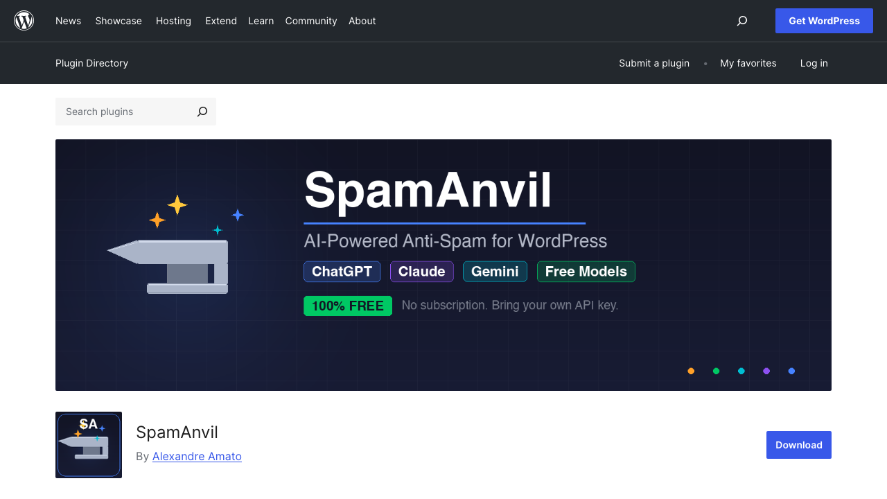

<p align="center">
  <a href="https://wordpress.org/plugins/spamanvil/">
    
  </a>
</p>

<h1 align="center">SpamAnvil</h1>

<p align="center">
  <strong>AI-powered anti-spam plugin for WordPress</strong><br>
  A swiss-army-knife of spam defenses — honeypot, time trap, rate limit, heuristics<br>
  and LLMs (ChatGPT, Claude, Gemini…) working together. 100% free. No subscription.
</p>

<p align="center">
  <a href="https://wordpress.org/plugins/spamanvil/"></a>
  <a href="https://www.gnu.org/licenses/gpl-2.0.html"></a>
  <a href="https://wordpress.org/plugins/spamanvil/"></a>
  <a href="#"></a>
  <a href="#"></a>
</p>

---

## Why SpamAnvil?

Traditional spam filters rely on static word lists and link counting. Spammers have evolved. **SpamAnvil fights back with AI that understands context, intent, and language patterns** -- catching spam that looks legitimate and approving real comments that others would flag.

| | Akismet | Antispam Bee | SpamAnvil |
|---|---|---|---|
| **Technique** | Cloud pattern matching | Honeypot + regex rules | Honeypot + time trap + rate limit + heuristics + **LLM understanding** |
| **Free for commercial sites** | No | Yes | Yes |
| **Data control** | Automattic servers | Local | Your chosen AI provider |
| **Multilingual** | Limited | No | Any language |
| **Self-hosted option** | No | N/A | Yes (Ollama, LM Studio, vLLM) |
| **Low-friction comments** | No | No | **Open Mode** (anonymous, no moderation wall) |

## Supported AI Providers

| Provider | Free Option | Default Model |
|----------|:-----------:|---------------|
| **OpenAI** | No | `gpt-4o-mini` |
| **OpenRouter** | Yes | `openrouter/free, openrouter/auto` (router chain: free pool first, paid auto as fallback) |
| **Anthropic Claude** | No | `claude-sonnet-5` |
| **Google Gemini** | Free tier | `gemini-2.0-flash` |
| **Featherless.ai** | Free tier | `meta-llama/Meta-Llama-3.1-8B-Instruct` |
| **Any OpenAI-compatible** | Varies | Custom URL + model |

## How It Works

Cheap, invisible layers run first and catch obvious bots for free; the AI is only spent on the subtle cases.

```
Comment submitted
  │
  ├─ 1. Rate limit ──── Too many from this IP too fast? ──→ 429 Too Many Requests
  │
  ├─ 2. IP blocked? ──── Yes ──→ 403 Forbidden
  │
  ├─ 3. Form traps ──── Honeypot filled OR submitted too fast? ──→ Spam (no API call)
  │
  ├─ 4. Heuristic pre-analysis (URLs, spam words, author patterns, injection)
  │     └─ Score very high? ──→ Auto-spam (no API call needed)
  │
  ├─ 5. Verdict cache ── Identical content seen recently? ──→ Reuse verdict
  │
  ├─ 6. Queue for AI analysis (async) or process immediately (sync)
  │     └─ LLM scores in context → {"score": 0-100, "reason": "..."}
  │
  ├─ 7. Score >= threshold (default 70)? ──→ Spam   else ──→ Approve
  │
  └─ 8. Repeat offender IPs auto-blocked (24h → 48h → 96h → … capped at 30 days)
```

With **Open Mode** on, comments publish instantly (no name/email/login/moderation) and spam is removed in the background instead of being held.

## Key Features

- **Layered Bot Defense** -- Honeypot, time trap and per-IP rate limit block obvious bots for free, before any AI call
- **AI-Powered Detection** -- LLM scores each comment 0-100 for spam probability (reasoning models supported -- their `<think>` output is parsed correctly)
- **Model Picker** -- Browse & search each provider's live model list from the settings page; OpenRouter shows `free` badges and context size
- **Open Mode** -- One toggle removes comment friction (no name/email/login/moderation) for effortless, even anonymous, real comments -- spam is removed in the background
- **Verdict Cache** -- Identical repeated spam reuses a recent AI verdict instead of paying for the API again
- **Intelligent Heuristics** -- Pre-analysis catches obvious spam without API calls
- **Adaptive Threshold** -- Analyzes historical data and suggests the optimal threshold
- **Async Processing** -- Background queue via WP-Cron, zero latency for visitors
- **Atomic Queue** -- Concurrent cron/manual runs never double-process (no duplicate paid calls)
- **Smart IP Blocking** -- Escalating bans for repeat offenders (24h, 48h, 96h… capped at 30 days)
- **Real "Test Connection"** -- Verifies actual spam classification, not just an HTTP 200
- **Encrypted Keys** -- AES-256-GCM (per-site salt), or wp-config.php constants
- **Model Chains** -- List several models per provider (comma-separated), tried in order — e.g. free models first, then paid
- **Fallback Provider** -- Backup AI so spam checking never stops; permanent config errors pause the queue (with an admin notice) instead of burning retries and flooding logs
- **Smart Email Notifications** -- No more one email per spam attempt: you're notified only after the verdict (ham → post author; undecidable → moderator; spam → silence), or via a single daily digest
- **Prompt Injection Defense** -- 6-layer protection against adversarial comments
- **Statistics, Logs & Health Alerts** -- Per-layer counts, AI reasoning per comment, and an admin warning when spam checking is silently failing
- **Customizable Prompts, Moderator Bypass, WooCommerce, Multilingual**
- **Tested & CI'd** -- PHPUnit unit + integration suites run in GitHub Actions across PHP 7.4-8.3

## Layered Defense (the swiss army knife)

Each layer is optional and runs **before** any paid API call, so cheap filters catch the obvious bots and the AI is only spent where it's needed:

| Layer | Cost | Catches |
|-------|:----:|---------|
| **Per-IP rate limit** | $0 | Comment floods from one IP |
| **Honeypot** | $0 | Bots that fill a hidden field |
| **Time trap** | $0 | Comments submitted implausibly fast (signed, fails open) |
| **Heuristics** | $0 | Obvious spam by content/author patterns |
| **Verdict cache** | $0 | Identical repeated spam (reuses a recent AI verdict) |
| **AI (LLM)** | $ | Everything subtle |

## Open Mode

Because the layers above filter spam **invisibly**, you can drop the friction that scares real commenters away. Flip **Open Mode** on (Settings → General) and:

- No required name/email — **anonymous comments allowed**
- No login required
- No first-comment moderation hold
- Comments **appear instantly**; SpamAnvil removes spam in the background

It's applied via filters, so it never overwrites your stored settings — turning it off restores them. Pair with Sync mode for zero delay on very low-traffic sites.

## Installation

### From WordPress Admin

1. Go to **Plugins > Add New**
2. Search for **SpamAnvil**
3. Click **Install Now** then **Activate**
4. Go to **Settings > SpamAnvil**
5. Choose a provider, enter your API key, done!

### Manual Install

1. Download `spamanvil.zip` from [Releases](https://github.com/alexandreamato/spamanvil/releases)
2. Go to **Plugins > Add New > Upload Plugin**
3. Upload the zip and activate

### Free Setup (Zero Cost)

1. Create a free account at [OpenRouter.ai](https://openrouter.ai/)
2. Generate an API key
3. In SpamAnvil, select **OpenRouter** as primary provider
4. Paste your key -- the default (`openrouter/free`) routes across OpenRouter's free-model pool — $0!

## Security

SpamAnvil follows WordPress security best practices throughout:

- **API Keys**: AES-256-GCM (AEAD) encrypted in DB — legacy CBC values still read — or define in `wp-config.php` (never touches DB)
- **All forms**: Nonce verification + capability checks (`manage_options`)
- **All queries**: `$wpdb->prepare()` prepared statements
- **All output**: Escaped with `esc_html()`, `esc_attr()`, `esc_url()`
- **All input**: Sanitized with `sanitize_text_field()`, `absint()`, `wp_kses_post()`
- **HTTP**: `wp_safe_remote_post()` (blocks internal/metadata IPs) with a 60s timeout
- **IPs**: Salted, keyed HMAC-SHA-256 hashes (not brute-forceable without your site secret), masked display
- **Client IP source**: Configurable trusted header (default `REMOTE_ADDR`) so a forged `X-Forwarded-For` can't bypass IP blocking/rate limiting; sites behind a proxy/CDN select their edge's header (e.g. Cloudflare)

### Prompt Injection Defense (6 layers)

| Layer | Defense |
|-------|---------|
| 1 | `<comment_data>` + `<commenter_data>` boundary tags isolate the comment body AND author name/email/URL |
| 2 | System prompt explicitly forbids following comment instructions |
| 3 | Heuristic regex detects injection patterns — in the body and in author fields |
| 4 | Strict JSON validation (only `score` + `reason` accepted) |
| 5 | Deterministic settings (temperature 0 where supported; thinking disabled on current Claude models) |
| 6 | Content truncated at 5,000 characters |

## Optional: wp-config.php API Keys

For maximum security, define keys as constants:

```php
define('SPAMANVIL_OPENAI_API_KEY', 'sk-...');
define('SPAMANVIL_OPENROUTER_API_KEY', 'sk-or-...');
define('SPAMANVIL_ANTHROPIC_API_KEY', 'sk-ant-...');
define('SPAMANVIL_GEMINI_API_KEY', '...');
define('SPAMANVIL_FEATHERLESS_API_KEY', '...');
```

When defined in `wp-config.php`, keys are never stored in the database.

## Architecture

```
spamanvil/
├── spamanvil.php                     # Bootstrap, constants, autoloader
├── uninstall.php                     # Clean removal (tables, options, crons)
├── includes/
│   ├── class-spamanvil.php           # Singleton orchestrator
│   ├── class-spamanvil-activator.php # DB schema (4 tables), defaults
│   ├── class-spamanvil-queue.php     # Async processing engine
│   ├── class-spamanvil-heuristics.php # Regex pre-analysis
│   ├── class-spamanvil-ip-manager.php # Smart IP blocking
│   ├── class-spamanvil-stats.php     # Metrics + threshold suggestion
│   ├── class-spamanvil-encryptor.php # AES-256-GCM encryption (reads legacy CBC)
│   ├── class-spamanvil-provider-factory.php
│   └── providers/
│       ├── class-spamanvil-provider.php          # Abstract base
│       ├── class-spamanvil-openai-compatible.php  # OpenAI/OpenRouter/Featherless/Generic
│       ├── class-spamanvil-anthropic.php          # Claude
│       └── class-spamanvil-gemini.php             # Gemini
├── admin/
│   ├── class-spamanvil-admin.php     # 6-tab settings, AJAX handlers
│   ├── css/admin.css
│   ├── js/admin.js
│   └── views/                        # 6 settings views
└── languages/
    └── spamanvil.pot                 # Translation template
```

## Extensibility

### Filters

```php
// Customize the prompt before sending to LLM
add_filter('spamanvil_prompt', function($prompt, $type, $comment) {
    // $type is 'system' or 'user'
    return $prompt;
}, 10, 3);

// Adjust threshold per comment
add_filter('spamanvil_threshold', function($threshold, $comment) {
    return $threshold;
}, 10, 2);

// Modify heuristic score
add_filter('spamanvil_heuristic_score', function($score, $signals, $data) {
    return $score;
}, 10, 3);
```

### Actions

```php
// Before LLM API call
add_action('spamanvil_before_analysis', function($comment, $item) {}, 10, 2);

// After analysis completes
add_action('spamanvil_after_analysis', function($comment, $result, $is_spam) {}, 10, 3);

// When spam is detected
add_action('spamanvil_spam_detected', function($comment, $result) {}, 10, 2);
```

## Third-Party Services

SpamAnvil sends comment data to your chosen AI provider for spam analysis. No data is sent until you configure and enable a provider.

| Provider | Website | Terms | Privacy |
|----------|---------|-------|---------|
| OpenAI | [openai.com](https://openai.com) | [Terms](https://openai.com/policies/terms-of-use) | [Privacy](https://openai.com/policies/privacy-policy) |
| Anthropic | [anthropic.com](https://www.anthropic.com) | [Terms](https://www.anthropic.com/policies#terms) | [Privacy](https://www.anthropic.com/policies#privacy) |
| Google Gemini | [ai.google.dev](https://ai.google.dev) | [Terms](https://ai.google.dev/gemini-api/terms) | [Privacy](https://policies.google.com/privacy) |
| OpenRouter | [openrouter.ai](https://openrouter.ai) | [Terms](https://openrouter.ai/terms) | [Privacy](https://openrouter.ai/privacy) |
| Featherless.ai | [featherless.ai](https://featherless.ai) | [Terms](https://featherless.ai/terms) | [Privacy](https://featherless.ai/privacy) |

## Requirements

- WordPress 5.8+
- PHP 7.4+
- An API key from any supported AI provider (free options available)

## License

GPLv2 or later. See [LICENSE.txt](spamanvil/LICENSE.txt).

## Author

**Alexandre Amato** -- [software.amato.com.br](https://software.amato.com.br/spamanvil-antispam-plugin-for-wordpress/)
